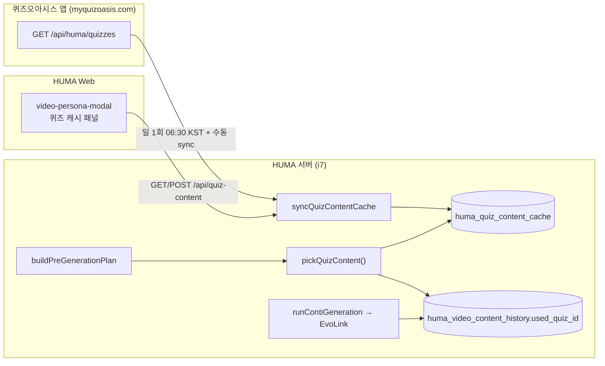

# HUMA × 퀴즈오아시스 — Cursor 개발 명령서

> **대상:** Cursor Agent / 개발자  
> **범위:** `workspace = quizoasis` — 영상 콘텐츠(콘티·릴스), 퀴즈 캐시 연동, 소셜 발행  
> **최종 반영:** v3.59~v3.60 (2026-06-18, commit `9d496b5` 기준)

---

## 0. Cursor 에이전트 사용법

이 문서를 작업 시작 시 **@docs/HUMA_퀴즈오아시스_커서_개발명령서.md** 로 첨부하거나, `.cursor/rules`에 퀴즈오아시스 관련 규칙으로 인용한다.

**에이전트가 반드시 지킬 것**

1. 변경 범위는 `quizoasis` 워크스pace와 직접 연관된 코드만. `yeonun` / `panana` 분기는 건드리지 않는다.
2. 퀴즈 목록은 **외부 API → Supabase 캐시 → 가중 선택** 3단 구조를 유지한다. 런타임에 매번 외부 API를 호출하지 않는다 (파나나 캐릭터 캐시와 동일 패턴).
3. `used_quiz_id`는 **외부 퀴즈 id 문자열** (`quiz_external_id`)을 저장한다. Supabase `huma_quiz_content_cache.id`(UUID)와 혼동 금지.
4. 마이그레이션 SQL은 `apps/server/scripts/migrations/`에 추가하고 Supabase SQL Editor에서 **수동 실행**한다 (자동 migrate 없음).
5. probe 스크립트(`apps/server/scripts/probe-*.mjs`)는 커밋하지 않는다.
6. 테스트: `npx vitest run apps/server/src/modules/video-content`

---

## 1. 시스템 개요



| 구분 | 값 |
|------|-----|
| Workspace ID | `quizoasis` |
| 동글 슬롯 | slot5 · SOCKS `:10005` |
| C-Rank 풀 | CRANK-AO ~ CRANK-AX (10계정) |
| 서비스 URL (캡션·멘션) | `https://quizoasis.com` (`SERVICE_URLS.quizoasis`) |
| 관리 도메인 (캐시 API) | `https://myquizoasis.com/api/huma/quizzes` |

---

## 2. 퀴즈오아시스 앱 측 — 구현 명세

HUMA가 호출하는 **단일 엔드포인트**를 퀴즈오아시스(Next.js/Vercel 등) 쪽에 구현한다.  
파나나 `GET /api/huma/characters` 와 **동일한 HUMA 연동 패턴**이다.

### 2.1 `GET /api/huma/quizzes`

**권장 URL:** `https://myquizoasis.com/api/huma/quizzes`  
**인증 (선택):** `Authorization: Bearer {QUIZOASIS_CONTENT_API_KEY}` 또는 `x-api-key` 헤더  
HUMA `.env`의 `QUIZOASIS_CONTENT_API_KEY`와 **동일 값**을 퀴즈오아시스 Vercel env에 설정.

**응답 형식 (둘 중 하나)**

```json
[
  {
    "id": "quiz_abc123",
    "slug": "mbti-real-type",
    "title": "진짜 MBTI 유형 테스트",
    "description": "15문항으로 숨겨진 성격 유형을 찾아보세요",
    "status": "active"
  }
]
```

또는

```json
{
  "quizzes": [ { "id": "...", "title": "...", "slug": "...", "description": "...", "status": "active" } ]
}
```

**필드 매핑 (HUMA 파서가 수용하는 별칭)**

| 필수 | HUMA 필드 | 수용 별칭 |
|------|-----------|-----------|
| ✅ | `id` | `quiz_id`, `test_id`, `slug`(최후) |
| ✅ | `title` | `name`, `test_name` |
| — | `slug` | `test_slug`, `path` |
| — | `description` | `summary`, `intro`, `tagline` |
| — | `status` | `active` / `inactive` 또는 `active: true/false` |

**동작 규칙**

- 목록에 **없어진 퀴즈**는 HUMA sync 시 `status=inactive` 처리 (삭제하지 않음).
- `inactive` 퀴즈는 영상 생성 pick 대상에서 제외.
- API 장애 시 HUMA는 **마지막 캐시**로 계속 운영 + Telegram 경고.

### 2.2 (향후) 퀴즈 상세 API — 미구현

현재는 `title` + `description`만 LLM에 전달한다.  
향후 slug별 결과 유형·문항 수·랜딩 URL 등을 넣으려면:

- `GET /api/huma/quizzes/:slug` 추가
- `formatQuizContext()` / `pickQuizContent()` 확장
- **캐시 테이블 컬럼 추가 마이그레이션** 필요

---

## 3. HUMA 서버 — 파일 맵

| 역할 | 경로 |
|------|------|
| 퀴즈 API fetch · 캐시 sync · 가중 pick | `apps/server/src/modules/video-content/quiz-content-cache.ts` |
| 일 06:30 KST 스케줄러 | `apps/server/src/lib/quiz-content-scheduler.ts` |
| 생성 전 plan (퀴즈 pick) | `apps/server/src/modules/video-content/pre-generation-plan.ts` |
| 1단계 펀치라인에 퀴즈 블록 | `apps/server/src/modules/video-content/punchline-pipeline.ts` |
| 3단계 콘티 foundation에 퀴즈 블록 | `apps/server/src/modules/video-content/conti-generator.ts` |
| `used_quiz_id` 저장 | `apps/server/src/modules/video-content/pipeline.ts` |
| REST | `apps/server/src/routes/video-content.ts` → `GET/POST /api/quiz-content` |
| 스케줄러 등록 | `apps/server/src/index.ts` → `startQuizContentSyncScheduler()` |
| 기본 페르소나 템플릿 | `apps/server/src/modules/video-content/types.ts` → `DEFAULT_VIDEO_PERSONAS.quizoasis` |
| IG/TikTok 릴스 변형 | `apps/server/src/modules/social/quizoasis-reels.ts` |
| 소셜 OAuth 접미사 | `QUIZOASIS` (`workspace-credentials.ts`) |

**파나나 대칭 참고:** `panana-characters.ts` + `panana-character-scheduler.ts` — 구조·네이밍·UI 패턴을 그대로 따른다.

---

## 4. 환경변수 & DB

### 4.1 서버 `.env`

```env
QUIZOASIS_CONTENT_API_URL=https://myquizoasis.com/api/huma/quizzes
QUIZOASIS_CONTENT_API_KEY=your_shared_secret
# QUIZOASIS_CONTENT_API_TIMEOUT_MS=60000
```

미설정 시: sync 스킵, pick 시 활성 퀴즈 0건 경고 로그.

### 4.2 Supabase 마이그레이션 (순서)

1. `v3_59_video_persona_and_punchline.sql` — `used_quiz_id`, `huma_video_persona`
2. `v3_60_quiz_content_cache.sql` — `huma_quiz_content_cache` + 인덱스

```sql
-- v3_60 핵심
CREATE TABLE huma_quiz_content_cache (
  quiz_external_id VARCHAR(100) UNIQUE,
  slug, title, description, status, synced_at ...
);
CREATE INDEX idx_huma_vch_workspace_used_quiz
  ON huma_video_content_history(workspace, used_quiz_id, created_at DESC);
```

---

## 5. 영상 콘텐츠 파이프라인 (quizoasis)

### 5.1 생성 흐름

1. **`buildPreGenerationPlan({ workspace: 'quizoasis', accountId })`**
   - `loadVideoPersonaText('quizoasis')` — 서비스 공통 페르소나
   - 축 랜덤: 관계축 · 감정곡선 · hook_type · hook_subtype · cut/duration
   - **`pickQuizContent()`** — 최근 20건 `used_quiz_id` 빈도 역가중

2. **`runContiGeneration`**
   - `huma_video_content_history` insert 시 `used_quiz_id = plan.quizContent.quizExternalId`
   - 펀치라인 3단계: `runPunchlineContiPipeline` (1→2→3)
   - dull 유머 시 **3단계만** 재생성 (`shots_only`, 1~2단계·foundation 유지)

3. **LLM 컨텍스트 주입**

   `formatQuizContext()` 출력 예:

   ```
   [퀴즈오아시스 테스트]
   slug: mbti-real-type
   제목: 진짜 MBTI 유형 테스트
   소개: 15문항으로 ...
   (이번 영상에 자연스럽게 녹일 심리테스트 — 결과 유형·펀치라인과 연결)
   ```

   - 1단계 펀치라인 발산: `punchline-pipeline.ts` `quizBlock`
   - 3단계 콘티: `conti-generator.ts` `quizContentContext`

4. **검토 → EvoLink → 자막 → 소셜** (workspace 공통, quizoasis 캡션/해시태그만 분기)

### 5.2 페르소나 (필수 섹션)

`persona-axis.ts` — `PERSONA_REQUIRED_HEADERS.quizoasis`:

`관계축` · `감정곡선` · `펀치라인 메커니즘` · `hook_subtype` · `컷 구성` · `샷 구조` · `서비스 제약`

- UI: 계정 → 🎬 영상 페르소나 (서비스 공통)
- API: `GET/PATCH /api/workspaces/quizoasis/video-persona`
- **deprecated:** `/api/accounts/:id/video-persona` (삭제됨)

### 5.3 서비스 제약 (기본값)

`DEFAULT_VIDEO_PERSONAS.quizoasis.serviceConstraints`:

- 한국어 전용
- 성격/심리 **단정·차별** 금지
- **의학적 진단** 표현 금지
- 백과사전형 설명체 금지
- 매번 **새 일반인** 등장 (캐릭터 IP 없음)
- 화면텍스트 제약 (`VIDEO_SCREEN_TEXT_RENDERING_CONSTRAINT`) 포함

---

## 6. Web UI & API

| UI | API |
|----|-----|
| `video-persona-modal.tsx` — 퀴즈 캐시 목록·동기화 | `api.quizContent()` → `GET /api/quiz-content` |
| 동일 — 「지금 동기화」 | `api.syncQuizContent()` → `POST /api/quiz-content/sync` |
| `video-content-view.tsx` — 검토대기/진행중 목록 | 탭당 10건 페이지네이션 |
| `video-view.tsx` | `quizoasis: '퀴즈오아시스 · MBTI 결과 릴스'` |

**권한:** `getWorkspaceFilter`에 `quizoasis` 포함된 admin만 sync 가능.

---

## 7. 소셜 · 기타 quizoasis 모듈

| 기능 | 위치 |
|------|------|
| TikTok 다국어 해시태그 | `buildQuizOasisTikTokHashtags()` |
| IG EN/KR 캡션 Haiku 변형 | `generateAccountCaption()` |
| IG EN/KR 릴스 업로드 | `uploadQuizOasisInstagramVariants()` |
| 블로그 포스팅 톤 | `content-generator.ts` quizoasis system prompt |
| AdSense / SEO 대시 | `dashboard-home.tsx` (workspace === quizoasis) |
| Pinterest Video Pin | env `PINTEREST_*` (퀴즈 전용 보드) |

---

## 8. 운영 체크리스트

### 최초 셋업

- [ ] Supabase `v3_59`, `v3_60` 실행
- [ ] 퀴즈오아시스 `GET /api/huma/quizzes` 배포 + API 키
- [ ] i7 `QUIZOASIS_CONTENT_API_URL` / `KEY` 설정
- [ ] HUMA Web → 퀴즈 계정 → 영상 페르소나 → **지금 동기화**
- [ ] `huma_video_persona`에 quizoasis 페르소나 저장 (7섹션)

### 일상 점검

- [ ] oplog `[quiz-sync]` — synced 건수
- [ ] 활성 퀴즈 0건 경고 → API URL·키·퀴즈앱 배포 확인
- [ ] `used_quiz_id` 분포 — 특정 퀴즈만 과다 사용 시 가중 pick 정상 동작 확인

### 배포

```bash
# i7
git pull && cd apps/server && npm run build && pm2 restart huma-server
# Vercel (web) — 자동 또는 redeploy
```

---

## 9. Cursor 작업 템플릿

### A. 퀴즈 API 스펙 변경

1. 퀴즈오아시스 앱 route 수정
2. `normalizeQuizApiResponse()` 테스트 추가/수정 (`punchline-pipeline.test.ts`에 quiz normalize 테스트 있음)
3. `.env.example` 주석 갱신

### B. pick 가중치·윈도우 변경

- `loadRecentUsedQuizIds(limit)` — 기본 20
- `pickWeightedByCounts()` — `panana-characters.ts` 공용
- 변경 후 vitest + staging에서 동일 quiz 연속 생성 여부 확인

### C. LLM에 더 풍부한 퀴즈 컨텍스트

1. 캐시 컬럼 + migration SQL
2. `syncQuizContentCache` upsert 필드 확장
3. `formatQuizContext()` + `PromptContext.quizContentContext` 확장
4. 펀치라인 1단계 rules에 “선택된 퀴즈 slug/유형 반드시 언급” 등 **프롬프트만** 추가 (하드코딩 slug 금지)

### D. 새 REST/UI

- 서버: `video-content.ts` 라우트 + `quiz-content-cache.ts` 함수
- 웹: `api.ts` + `video-persona-modal.tsx` (panana 패널 복제)

---

## 10. 금지 · 주의

| ❌ 금지 | ✅ 대신 |
|---------|---------|
| 영상 생성마다 myquizoasis API 직접 호출 | 캐시 sync 후 `pickQuizContent()` |
| `used_quiz_id`에 cache UUID 저장 | `quiz_external_id` (외부 id 문자열) |
| 퀴즈 slug 하드코딩 in conti/pipeline | plan에서 pick된 값만 사용 |
| quizoasis 변경 시 panana pick 로직 공유 수정 | workspace 분기 유지 |
| probe 스크립트 커밋 | 로컬 디버그만 |

---

## 11. 관련 문서

- `docs/HUMA_v3.28_운영정합.md` — C-Rank·동글 slot5 퀴즈 배정
- `apps/server/.env.example` — QUIZOASIS_* 변수
- 파나나 연동 참고: `PANANA_CHARACTER_API_URL` 주석 블록

---

**문서 버전:** 2026-06-18 · HUMA main `9d496b5`
